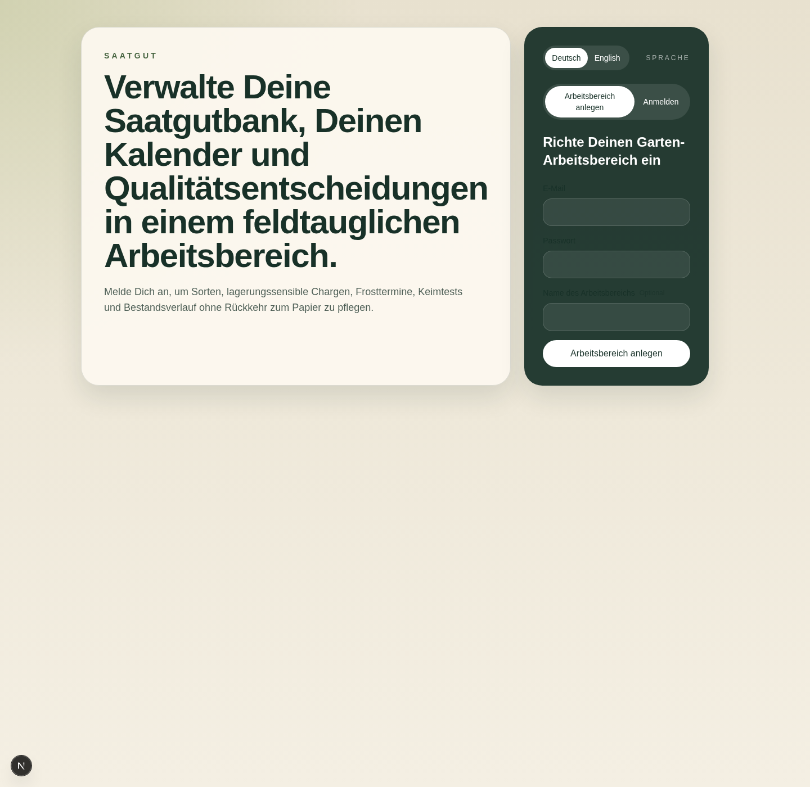
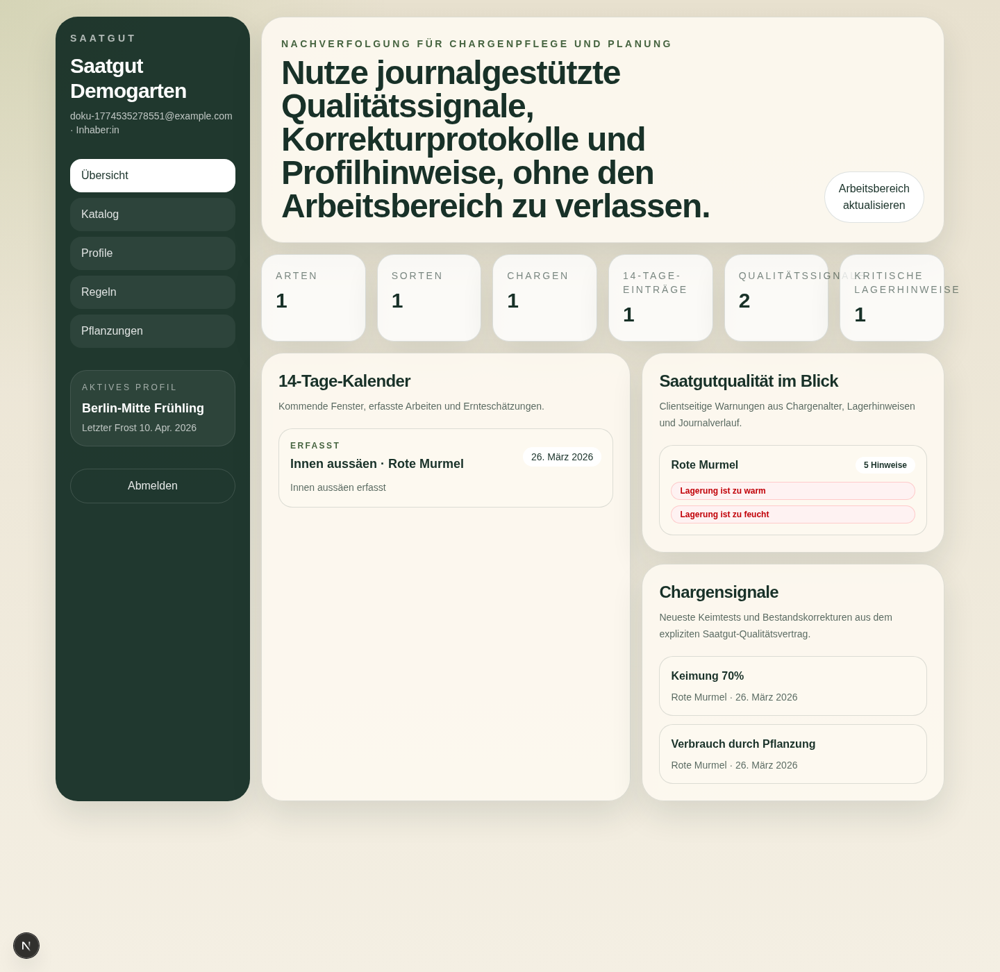
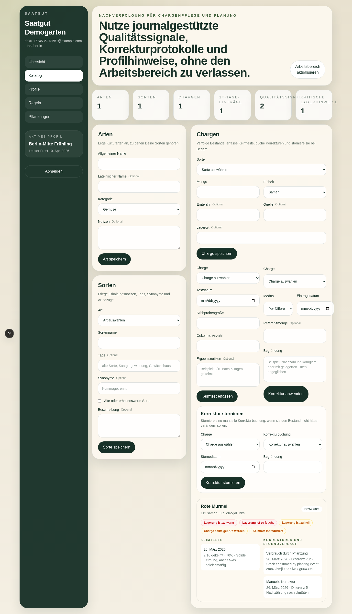
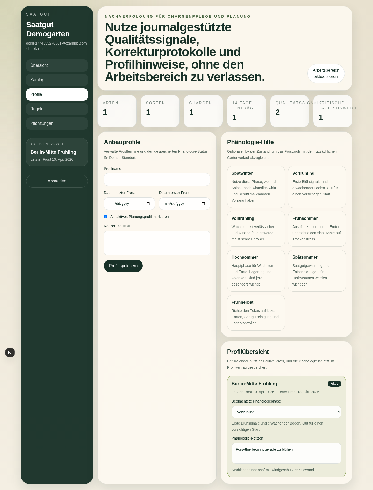
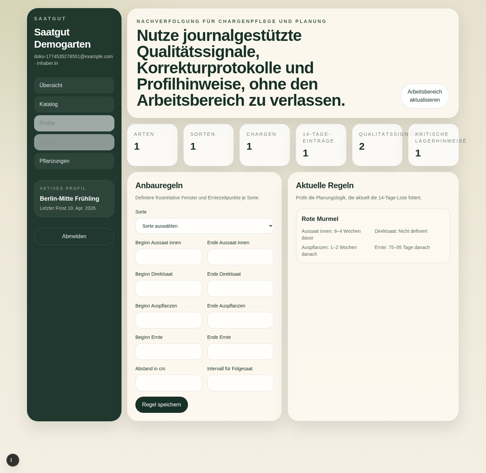
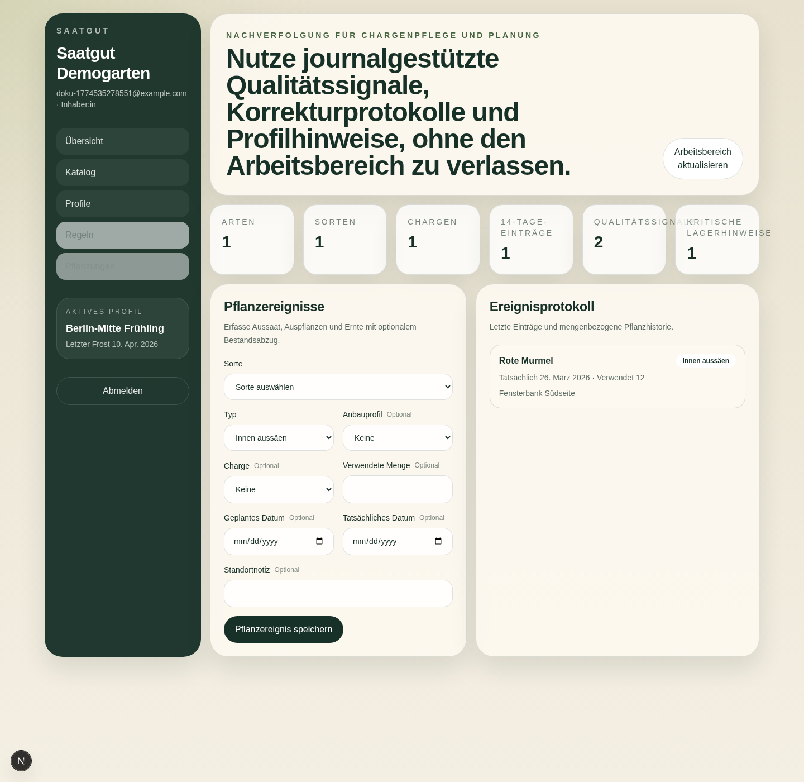

# Saatgut Benutzerhandbuch

Dieses Handbuch beschreibt den aktuell ausgelieferten Stand von Saatgut aus Sicht von Endnutzer:innen. Die Oberfläche ist standardmäßig deutschsprachig, und die folgenden Schritte orientieren sich an den tatsächlich ausgelieferten Ansichten auf `main`.

## 1. Arbeitsbereich anlegen und anmelden

Beim ersten Aufruf legst Du einen neuen Arbeitsbereich mit E-Mail-Adresse, Passwort und Arbeitsbereichsname an. Bestehende Nutzer:innen wechseln über den Reiter `Anmelden` zurück in ihren vorhandenen Arbeitsbereich. Die Sprache ist standardmäßig auf Deutsch gesetzt und kann über den Sprachschalter umgestellt werden.

## 2. Übersicht nutzen

Nach der Anmeldung landest Du in der `Übersicht`. Dort bündelt Saatgut die wichtigsten Signale für den laufenden Gartenbetrieb:

- Kennzahlen zu Arten, Sorten, Chargen und Qualitätssignalen
- den `14-Tage-Kalender` mit kommenden Fenstern und bereits erfassten Arbeiten
- `Saatgutqualität im Blick` für Lagerwarnungen
- `Chargensignale` für Keimtests und Bestandskorrekturen

Über `Arbeitsbereich aktualisieren` lädst Du alle Daten neu, ohne die Seite zu verlassen.

## 3. Katalog pflegen

Im Bereich `Katalog` verwaltest Du die fachlichen Stammdaten:

- `Arten` für Kulturgruppen wie Tomate, Bohne oder Salat
- `Sorten` mit Tags, Synonymen und Erhaltungsnotizen
- `Chargen` mit Menge, Erntejahr, Herkunft und Lagerdaten
- `Keimtests`, `Korrekturen` und `Korrekturstorno` direkt an der Charge

Die Chargenkarten im unteren Bereich zeigen Dir Warnhinweise, Keimtest-Historie und Bestandsbewegungen in einer Ansicht.

## 4. Anbauprofile und Phänologie verwalten

Unter `Profile` hinterlegst Du standortbezogene Frosttermine und markierst genau ein aktives Planungsprofil. Dieses aktive Profil steuert die Kalenderberechnung. Zusätzlich kannst Du eine beobachtete Phänologiephase und freie Notizen speichern, um den rechnerischen Frostkalender mit dem tatsächlichen Saisonverlauf abzugleichen.

Typische Nutzung:

- Profilname und Frosttermine eintragen
- `Als aktives Planungsprofil markieren`
- beobachtete Phänologiephase auswählen
- ergänzende Standortnotizen dokumentieren

## 5. Anbauregeln für die Planung hinterlegen

Im Bereich `Regeln` definierst Du für jede Sorte die frostrelativen Arbeitsfenster. Diese Regeln speisen den `14-Tage-Kalender` auf der Übersichtsseite. Hinterlegt werden können unter anderem:

- Zeitraum für `Aussaat innen`
- Zeitraum für `Direktsaat`
- Zeitraum für `Auspflanzen`
- Erntefenster
- Pflanzabstand und Folgesaat-Intervall

Sobald mindestens eine Regel mit einem aktiven Profil kombiniert ist, erscheinen daraus abgeleitete Kalendereinträge in der Übersicht.

## 6. Pflanzungen und Bestandsabzüge erfassen

Unter `Pflanzungen` dokumentierst Du tatsächliche oder geplante Gartenarbeiten. Du kannst dort Aussaaten, Auspflanzungen und Ernten erfassen und optional eine Charge verknüpfen. Wenn eine Menge angegeben ist, reduziert Saatgut den verfügbaren Chargenbestand automatisch.

Die Ereignisliste darunter zeigt die zuletzt erfassten Arbeiten mit Datum, Typ und Standortnotiz.

## 7. Empfohlener Arbeitsablauf

Für einen sauberen Start im Alltag funktioniert diese Reihenfolge gut:

1. Arbeitsbereich anlegen oder anmelden.
2. Im `Katalog` zuerst Arten und danach Sorten erfassen.
3. Eine oder mehrere `Chargen` mit Lagerdaten anlegen.
4. Ein aktives `Profil` mit Frostterminen speichern.
5. Pro Sorte passende `Regeln` hinterlegen.
6. Zur `Übersicht` wechseln und den `14-Tage-Kalender` prüfen.
7. Unter `Pflanzungen` erledigte Arbeiten dokumentieren und Bestände automatisch fortschreiben lassen.

## 8. Was derzeit nicht in der Hauptoberfläche liegt

Einige ausgelieferte Funktionen sind vorhanden, aber aktuell eher für fortgeschrittene Nutzung oder Integrationen gedacht. Sie werden nicht vollständig über die Hauptnavigation der Oberfläche bedient:

- Einladungen und Benutzerverwaltung: `/api/v1/admin/invites`, `/api/v1/admin/users`
- API-Tokens: `/api/v1/admin/api-tokens`
- Aufgaben und Erinnerungen: `/api/v1/tasks`
- Datenexport: `/api/v1/exports/workspace`
- OpenAPI-Dokument: `/api/v1/openapi.json`
- MCP-Endpunkt: `/api/v1/mcp`

Wenn Du diese Funktionen nutzen willst, plane sie als API- oder Integrationsworkflow ein und nicht als Teil des normalen Katalog- und Pflanzalltags in der Hauptansicht.
